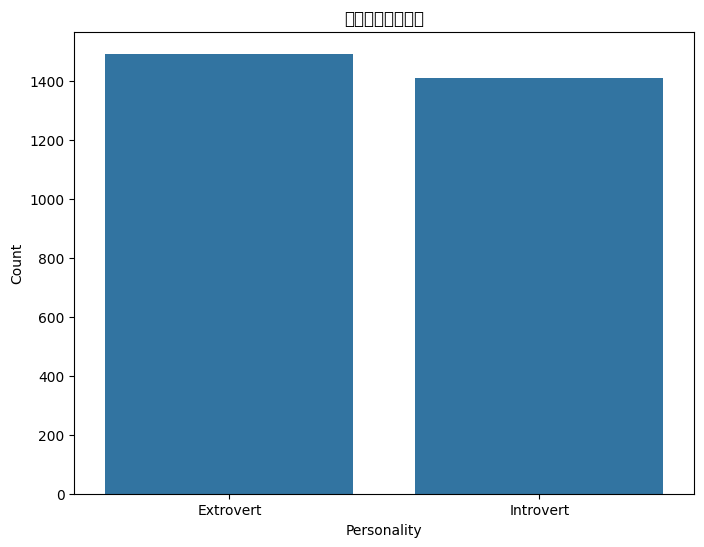
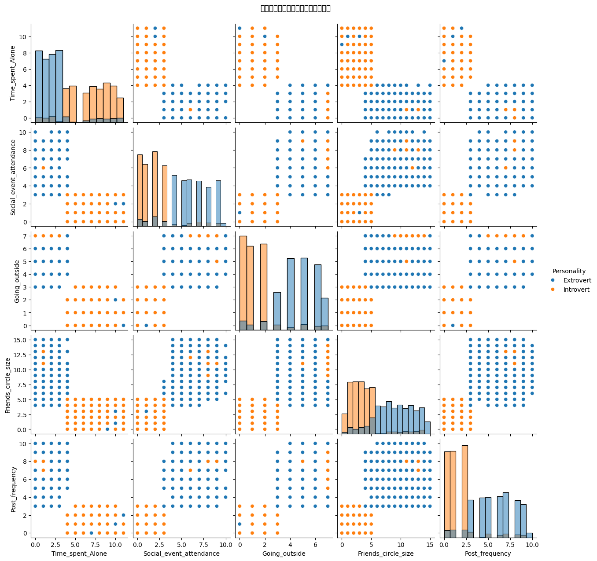
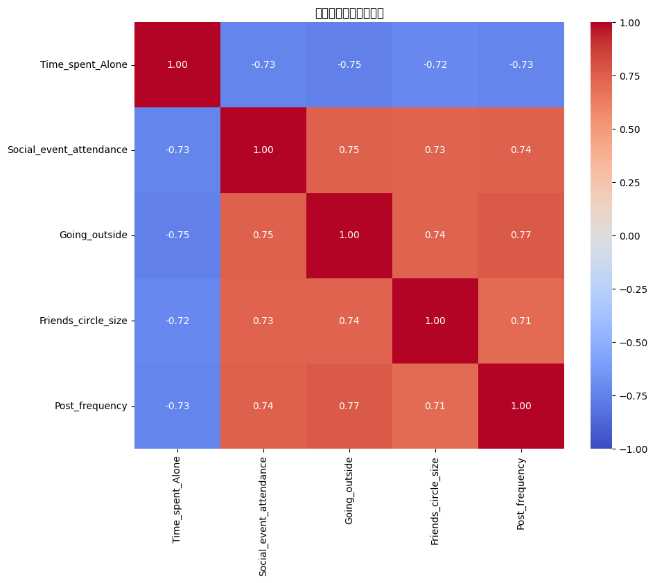

# E&I Personality Classifier

> 基于 Python 与集成学习的性格外向 / 内向预测项目

## 项目简介

本项目基于一份人格问卷数据（`personality_dataset.csv`），通过特征工程和多种机器学习模型，自动预测个体更偏向 **内向（Introvert）** 还是 **外向（Extrovert）**。项目包含：

- **数据探索与可视化**：性格类型分布、箱线图、特征关系矩阵、相关性热力图等
- **完整特征工程流程**：缺失值填充、异常值处理、编码、衍生特征、多项式交互特征、标准化
- **多模型比较与超参数搜索**：Logistic Regression、SVM、Random Forest、Gradient Boosting、KNN、Decision Tree、XGBoost
- **Stacking 集成模型**：以多模型作为基学习器，Logistic Regression 作为元学习器
- **结果分析与模型持久化**：分类报告、混淆矩阵、ROC 曲线、特征重要性分析，以及保存可复用的模型与预处理器

## 目录结构

```bash
EandI/
├── main.py                     # 主脚本：数据处理、建模、可视化、模型保存
├── main.ipynb                  # Jupyter 笔记本版本（如有使用）
├── personality_dataset.csv     # 人格问卷数据集
├── 1.html                      # 可能的可视化/报告导出
├── 2.py                        # 其他实验脚本（如有）
├── 3.js                        # 其他前端/可视化脚本（如有）
├── image/                      # 可视化图像输出
│   ├── output.png
│   ├── output1.png
│   ├── output2.png
│   ├── 不同性格类型的数值特征分布.png
│   ├── 性格类型分布情况.png
│   ├── 特征变量关系矩阵图.png
│   └── 特征相关性热力图.png
├── stacking_personality_model.joblib  # 训练好的堆叠模型
├── scaler.joblib               # 标准化器（StandardScaler）
├── label_encoder.joblib        # 标签编码器（LabelEncoder）
├── poly_features.joblib        # 多项式特征生成器（PolynomialFeatures）
└── README.md                   # 项目说明文件
```

## 环境依赖

建议使用 Python 3.9+。

主要依赖如下（仅列出关键库）：

- `pandas`
- `numpy`
- `matplotlib`
- `seaborn`
- `scikit-learn`
- `xgboost`
- `joblib`

可以使用如下方式安装：

```bash
pip install pandas numpy matplotlib seaborn scikit-learn xgboost joblib
```

> 如需更加稳定的环境，建议新建虚拟环境（例如 `conda` 或 `venv`），再安装上述依赖。

## 数据说明

数据文件：`personality_dataset.csv`

主要字段（示例）：

- `Time_spent_Alone`：独处时间
- `Social_event_attendance`：社交活动参与频率
- `Going_outside`：外出频率
- `Friends_circle_size`：朋友圈大小
- `Post_frequency`：社交媒体发帖频率
- `Stage_fear`：是否存在舞台恐惧（是/否）
- `Drained_after_socializing`：社交后是否感到精疲力竭（是/否）
- `Personality`：目标变量，性格类型（如 Extrovert / Introvert）

> 具体字段名称与含义以实际数据文件为准，代码中会根据这些字段进行清洗与建模。

## 功能流程概览

`main.py` 中的主要步骤如下：

1. **数据加载与基本探索**
   - 读取 `personality_dataset.csv`
   - 查看数据形状、字段信息、缺失值统计

2. **数据可视化分析**
   - 性格类型分布柱状图
   - 不同性格类型的数值特征分布（箱线图）
   - 数值特征与性格类型的关系矩阵图
   - 特征相关性热力图

3. **特征工程**
   - 目标编码（`LabelEncoder`）
   - 数值特征缺失值：中位数填充
   - 分类特征缺失值：众数填充
   - 分类特征 one-hot 编码（`get_dummies`）
   - 异常值 IQR 封顶（clip）
   - 衍生特征：
     - `Alone_to_Social_Ratio`（独处时间 / 社交频率）
     - `Social_Comfort_Index`（朋友圈大小 + 发帖频率 − 舞台恐惧）
     - `Social_Overload`（社交疲惫 × 社交频率）
   - 分桶特征：独处时间分为 `Low` / `Medium` / `High` 并做 one-hot
   - 多项式交互特征：基于 `Time_spent_Alone`、`Social_event_attendance`、`Friends_circle_size`
   - 标准化：`StandardScaler`

4. **模型训练与超参数搜索**
   - 划分训练集 / 测试集（`train_test_split`，分层抽样）
   - 为多种模型构建参数搜索空间
   - 使用 `RandomizedSearchCV` + 3 折交叉验证，以加权 F1 (`f1_weighted`) 作为指标
   - 汇总各模型的最佳得分与参数

5. **Stacking 集成模型**
   - 基学习器：Random Forest、Gradient Boosting、XGBoost、SVM
   - 元学习器：Logistic Regression
   - 在标准化后的训练集上进行训练
   - 使用交叉验证评估集成模型表现

6. **模型评估与可视化**
   - 在测试集上输出分类报告（精确率、召回率、F1 分数等）
   - 绘制混淆矩阵
   - 绘制 ROC 曲线与 AUC 指标
   - 使用 Random Forest 分析特征重要性并绘制条形图

7. **模型与预处理器保存**
   - 保存堆叠模型：`stacking_personality_model.joblib`
   - 保存标准化器：`scaler.joblib`
   - 保存标签编码器：`label_encoder.joblib`
   - 保存多项式特征生成器：`poly_features.joblib`

## 可视化结果示例

以下为部分模型训练与数据分析的可视化结果（图片均位于 `image/` 目录，GitHub 将自动渲染显示）：

### 性格类型分布



### 不同性格类型的数值特征分布


### 特征变量关系矩阵图



### 特征相关性热力图



## 如何运行

1. **克隆仓库或下载代码**

```bash
git clone https://github.com/<your-username>/eandI-personality-classifier.git
cd eandI-personality-classifier
```

2. **准备环境与数据**

- 确保已安装前文中的依赖包
- 确保 `personality_dataset.csv` 位于项目根目录（或在 `main.py` 中修改路径）

> 当前代码中 `pd.read_csv(...)` 使用的是本地绝对路径，你在上传 GitHub 后，建议将其改为相对路径，例如：
>
> ```python
> data = pd.read_csv('personality_dataset.csv')
> ```

3. **运行主脚本**

```bash
python main.py
```

脚本运行后会：

- 在控制台输出数据基本信息与模型评估指标
- 弹出多张可视化图像（如性格分布、箱线图、热力图、ROC 曲线等）
- 在项目目录生成 / 覆盖：
  - `stacking_personality_model.joblib`
  - `scaler.joblib`
  - `label_encoder.joblib`
  - `poly_features.joblib`

## 复用已训练模型（示意）

如果你希望在其他脚本中加载已训练好的模型进行预测，大致流程如下（示例代码）：

```python
import joblib
import pandas as pd

# 1. 加载模型与预处理器
stacking_model = joblib.load('stacking_personality_model.joblib')
scaler = joblib.load('scaler.joblib')
label_encoder = joblib.load('label_encoder.joblib')
poly = joblib.load('poly_features.joblib')

# 2. 准备输入数据（需要与训练时的特征工程保持一致）
# 示例：单条或多条样本构成的 DataFrame
new_data = pd.DataFrame([
    {
        'Time_spent_Alone': 5,
        'Social_event_attendance': 3,
        'Going_outside': 4,
        'Friends_circle_size': 20,
        'Post_frequency': 2,
        'Stage_fear': 'Yes',
        'Drained_after_socializing': 'No',
        # 其他字段同训练数据...
    }
])

# 3. 按照 main.py 中的流程进行同样的清洗与特征工程
# （缺失值填充、编码、衍生特征、多项式特征、标准化等）
# 这里略去实现细节，建议封装成函数以避免重复代码。

# 4. 预测
X_scaled = scaler.transform(processed_features)  # processed_features 为特征工程后的矩阵
proba = stacking_model.predict_proba(X_scaled)
pred = stacking_model.predict(X_scaled)

# 5. 将数字标签映射回原始性格类别
personality = label_encoder.inverse_transform(pred)
print(personality)
```

> 提示：如果后续要做成 Web 服务或应用，建议把“特征工程 + 预测”拆成独立的函数或模块，方便在 API、前端或其他系统中调用。

## 后续改进方向

- 加入更多与人格相关的特征（如职业、兴趣偏好等）
- 尝试更多集成方法（如 Voting、Bagging、Stacking 不同组合）
- 使用 SHAP / LIME 等工具进行可解释性分析
- 封装为 Web API 或前端 Demo，实时输入问卷答案后给出性格预测结果

## 许可证

根据实际需求自行选择许可证类型（如 MIT、Apache-2.0 等），并在仓库中添加 `LICENSE` 文件。